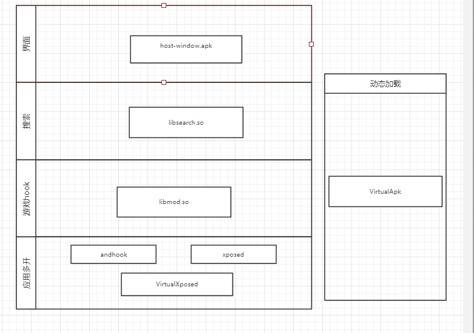
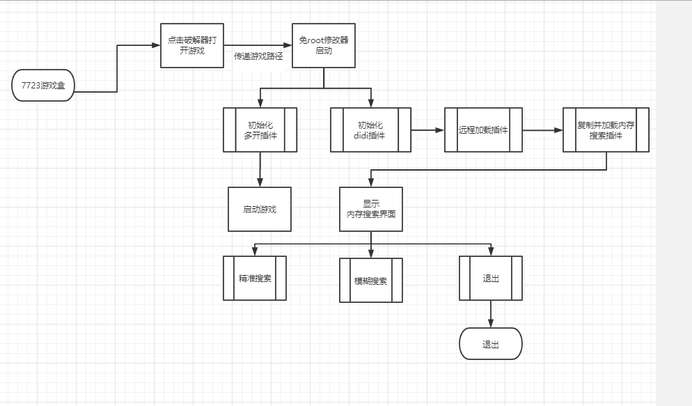

#  7723免root修改器功能分析：

### 分析过程

`通过7723游戏下载免root修改器,脱壳得到代码进行分析`

- io.xmbz.virtualapp2157568.dex
  - VirtualApk和界面相关代码
 - io.xmbz.virtualapp3399528.dex
     - VirtualXposed和界面相关代码 
- VirtualXposed
  - 实现应用内打开游戏
- VirtualApk
  - 实现动态加载插件
- host-window.apk
  - 界面
- AndHook
  - hook native函数
- Xposed 
  - hook java函数
- jp.garud.ssimulator.zip
  - 对应每一个游戏进行一些hook

### 实现原理

**在修改器内打开游戏，然后利用内存搜索编辑技术修改特定的内存值 **

### 基本结构 

### 流程图

### 实现疑难

- 应用内多开的兼容性和稳定性
- 内存搜索编辑技术的实现和有效性

   
 

